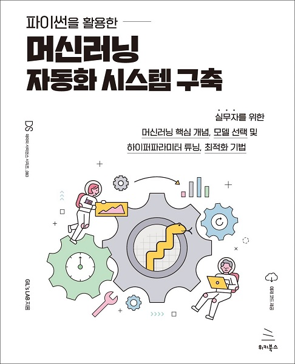

# 파이썬을 활용한 머신러닝 자동화 시스템 구축
### 실무자를 위한 머신러닝 핵심 개념, 모델 선택 및 하이퍼파라미터 튜닝, 최적화 기법

- GIL's LAB 지음
- 28,000원 | 2022년 8월 31일 발행 | 412쪽
- [책 홈페이지](https://wikibook.co.kr/automl/)
- [도서 미리보기](http://www.yes24.com/Product/Viewer/Preview/112207887)
- [도서 관련 문의](https://wikibook.co.kr/support/contact/)

---

**머신러닝 자동화를 통해 데이터 분석과 모델 개발에만 집중하세요!**

머신러닝 자동화 시스템의 원리는 머신러닝 실무자에게 굉장히 중요한 내용입니다. 이 책에서는 데이터 탐색 방법을 비롯해 탐색 결과에 따른 적절한 전처리 기법과 모델 선택, 최적화 기법을 이용한 하이퍼파라미터 튜닝 등 머신러닝 실무에 꼭 필요한 내용을 자세히 설명합니다. 이 책의 내용이 머신러닝 실무자에게 도움이 되길 바랍니다.

---
 
 ## 구입처
 
 - [예스24](http://www.yes24.com/Product/Goods/112207887)
 - [교보문고](http://www.kyobobook.co.kr/product/detailViewKor.laf?barcode=9791158393427)
 - [인터파크](http://book.interpark.com/product/BookDisplay.do?_method=detail&sc.prdNo=355140986)
 - [알라딘](https://www.aladin.co.kr/shop/wproduct.aspx?ItemId=300317422)
